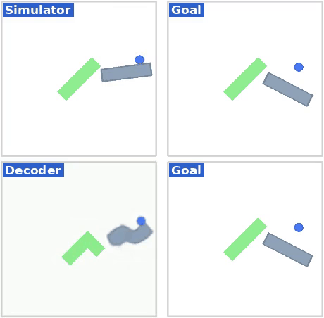

# AdaJEPA: An Adaptive Latent World Model

**Abstract:** Latent world models enable planning from high-dimensional observations by predicting future states in a compact latent space. However, these models are typically kept frozen at test time: when their predictions become inaccurate, planning can fail, especially under test-time distribution shift. To address this, we propose AdaJEPA, an adaptive latent world model that performs test-time adaptation within the closed loop of model predictive control (MPC). After training, AdaJEPA plans and executes the first action chunk, uses the observed next-state transition as a self-supervised adaptation signal, and replans with the updated model. This closed-loop update continuously recalibrates the world model without additional expert demonstrations. Across a range of goal-reaching tasks, AdaJEPA substantially improves planning success with as few as one gradient step per MPC replanning step.

<p align="center">
  &#151; <a href="https://agenticlearning.ai/adajepa/"><b>View Paper Website</b></a> &#151;
  <a href="https://arxiv.org/abs/2606.32026"><b>View Paper</b></a> &#151;
</p>


## Getting Started

1. [Installation](#installation)
2. [AdaJEPA](#adajepa)
3. [Released Checkpoints and Eval Data](#released-checkpoints-and-eval-data)
4. [Evaluation](#evaluation)

## Installation

```bash
git clone https://github.com/agentic-learning-ai-lab/adajepa.git
cd adajepa
conda env create -f environment.yaml
conda activate ts
```

The environment is identical to [temporal-straightening](https://github.com/agentic-learning-ai-lab/temporal-straightening)'s; see its README for details. MuJoCo is only needed for the maze environments — PushT/PushObj evaluation works without it.

## AdaJEPA

This repository contains the AdaJEPA code on top of [temporal-straightening](https://github.com/agentic-learning-ai-lab/temporal-straightening) (itself built on [DINO-WM](https://github.com/gaoyuezhou/dino_wm)). The major changes are summarized below.

| Component | What it does |
|---|---|
| `planning/adajepa.py` | `AdaJEPATrainer`: adapts the predictor (and optionally the encoder) using latent prediction loss |
| `planning/adajepa_mpc.py` | `AdaJEPAMPCPlanner`: per-episode MPC with adaptation plugged into the replan loop |
| `planning/image_corruption.py` | Eval-time visual shifts: blur / salt-and-pepper / dark applied to observations in code, plus env-rendered color shifts via `env_kwargs_override` |
| `env/pointmaze/maze_model.py` | Eval-time dynamics shifts: `density_scale` / `damping_scale` kwargs rebuild the maze MJCF with scaled body density (mass) and joint damping, injected via `env_kwargs_override` |
| `datasets/diverse_maze_goals.py` | Eval-time layout shifts: BFS distance-controlled (start, goal) sampling on held-out maze layouts, each eval episode built with its own maze |


## Released Checkpoints and Eval Data

Download the released [checkpoints and data](https://drive.google.com/drive/folders/11IVDIrVDU6W47txR_ku1RkhRUj9F4ybs?usp=sharing) (medium-maze data is hosted [separately](https://drive.google.com/drive/folders/1qbPO9MK7LwX2GBQq-fP_xXoy82wYlkde?usp=sharing)) and put them in `checkpoints/` and `data/` at the repo root. All released checkpoints include a decoder for visualization (see [Visualization](#visualization)). To train these world models yourself, use the training code in [temporal-straightening](https://github.com/agentic-learning-ai-lab/temporal-straightening).

## Evaluation

The default adaptation setting (used in the paper): one gradient step per MPC iteration on the predictor's last transformer layer and the encoder's head, with learning rates `adapt.lr=5e-4` / `adapt.encoder_lr=1e-5` and a `recent5` replay buffer of executed segments. Each evaluation sample adapts independently from the pretrained weights. All knobs live under the `planner.adapt` block of the config: `adapt.{lr,steps,optimizer,finetune_every,replay_buffer,finetune_encoder,encoder_lr,last_layer_only,encoder_last_layer_only}`. These defaults are a good starting point, but you may want to tune them to your setting (e.g. a larger test-time shift may need a larger lr and/or more steps).

For the frozen baseline, use `planner._target_=planning.mpc.MPCPlanner '~planner.adapt'`, which skips adaptation and plans all samples in one batch (setting `planner.adapt.lr=0 planner.adapt.steps=0` is equivalent but slower).

Run from the repo root:

```bash
REPO=$(pwd)

# shape shift: pick one of val_{T,L,Z,+,I,small_tee,square}
python plan.py --config-name adajepa_plan_gd_pushobj.yaml \
    ckpt_base_path=$REPO/checkpoints/pushobj_shape_shift \
    eval_data_path=$REPO/data/pushobj_eval/val_I/plan_targets.pkl \
    +wandb_logging=false

# visual shift: corruption conditions on val_T
python plan.py --config-name adajepa_plan_gd_pushobj.yaml \
    ckpt_base_path=$REPO/checkpoints/pusht_visual_shift \
    eval_data_path=$REPO/data/pushobj_eval/val_T/plan_targets.pkl \
    ood_corruption=blur +wandb_logging=false    # blur | snp1 | dark (+ood_level=0.9)

# visual shift: color conditions on val_T
python plan.py --config-name adajepa_plan_gd_pushobj.yaml \
    ckpt_base_path=$REPO/checkpoints/pusht_visual_shift \
    eval_data_path=$REPO/data/pushobj_eval/val_T/plan_targets.pkl \
    '++env_kwargs_override.agent_color=Red' +wandb_logging=false
# red block: ++env_kwargs_override.color=Red ; red anchor: ++env_kwargs_override.goal_color=Red

# dynamics shift: default and modified dynamics on medium maze
python plan.py --config-name adajepa_plan_gd_maze.yaml \
    ckpt_base_path=$REPO/checkpoints/mediummaze_dynamics_shift \
    eval_data_path=$REPO/data/point_maze_medium +wandb_logging=false
# low density:  ++env_kwargs_override.density_scale=0.2
# high damping: ++env_kwargs_override.damping_scale=20

# layout shift: BFS distance-controlled goals on held-out maze layouts
python plan.py --config-name adajepa_plan_gd_diversemaze.yaml \
    ckpt_base_path=$REPO/checkpoints/diversemaze_layout_shift \
    eval_data_path=$REPO/data/diverse_maze +wandb_logging=false
```

CEM planning uses `--config-name adajepa_plan_cem_<env>.yaml` with the same arguments.

The multi-layout maze setting follows [PLDM](https://arxiv.org/abs/2502.14819): the world model is trained on a set of maze layouts and evaluated on held-out ones. To generate the full dataset, follow the [PLDM codebase](https://github.com/vladisai/PLDM) (`pldm_envs/diverse_maze`).

### Visualization

We additionally train a decoder for interpretability: the *Simulator* row shows real environment frames, the *Decoder* row shows the decoded imagination, and the *Goal* column shows the target (tags are red for AdaJEPA runs, blue for frozen). Enable it with `decode_for_viz=true`. The provided `pusht_visual_shift` ckpt was trained without a decoder, so it ships a probe decoder trained post-hoc on frozen in-distribution PushT latents.

The shape and maze checkpoints ship the VQVAE decoder that was co-trained with the world model. The decoder reconstructs observations toward the structure it saw during training: e.g. the unseen I shape is rendered as training-like shapes in the Decoder row below.

<p align="center">
  
  
</p>
<p align="center">
  <i>Planning with an unseen I shape: AdaJEPA (left, red) reaches the goal; the frozen one (right, blue) does not.</i>
</p>

## Acknowledgement

This repository builds on [temporal-straightening](https://github.com/agentic-learning-ai-lab/temporal-straightening) and [DINO-WM](https://github.com/gaoyuezhou/dino_wm). We are grateful to the authors for sharing open-source implementations.

## Citation

If you find this repo useful, please cite:

```
@article{wang2026adajepa,
  title={AdaJEPA: An Adaptive Latent World Model},
  author={Wang, Ying and Bounou, Oumayma and LeCun, Yann and Ren, Mengye},
  journal={arXiv preprint arXiv:2606.32026},
  year={2026}
}

@article{wang2026temporal_straightening,
  title={Temporal Straightening for Latent Planning},
  author={Wang, Ying and Bounou, Oumayma and Zhou, Gaoyue and Balestriero, Randall and Rudner, Tim GJ and LeCun, Yann and Ren, Mengye},
  journal={ICML},
  year={2026}
}
```
